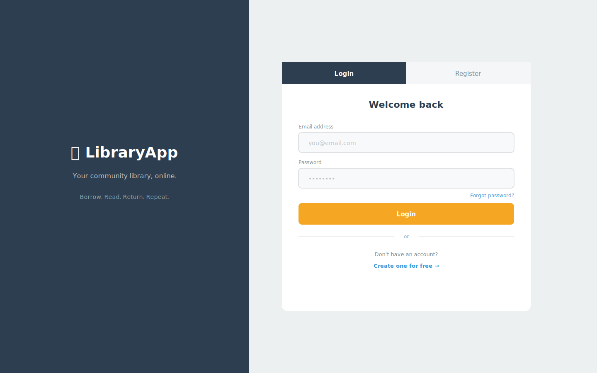
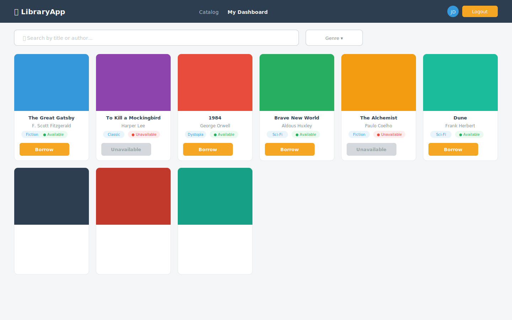
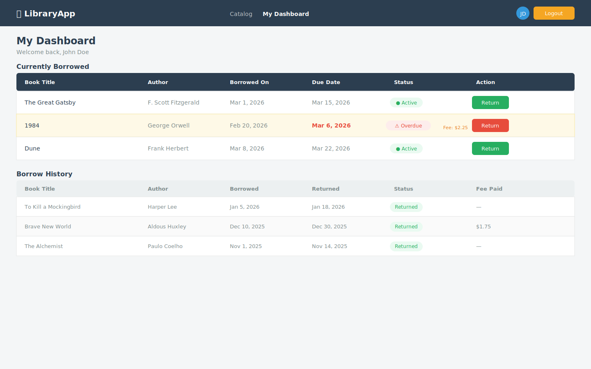
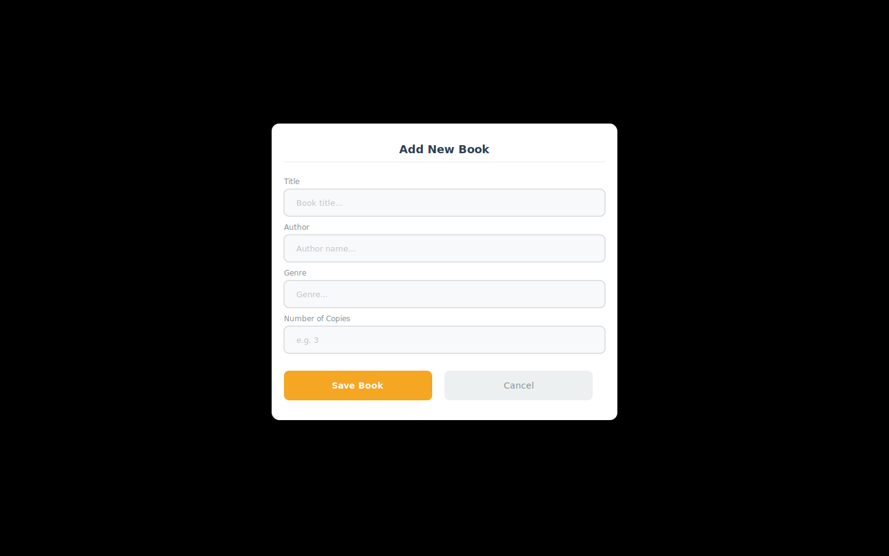

# 🖥️ Frontend Developer Guide

This document outlines what the frontend developer needs to build.

---

## 🎯 Your Role

You are responsible for building the **user-facing interface** of the Library WebApp.  
The backend API will be running on `http://localhost:3000/api`. All data comes from there via `fetch()` calls.

> ⚠️ Do not hardcode data. Every list, user detail, and book status must come from the API.

---

## 🚀 Getting Started

**No installs required.** You only need:
- A code editor (VS Code recommended)
- A browser

The files live in `frontend/`. Express serves them automatically when the backend is running — just open `http://localhost:3000` in your browser.

> To test API calls, the backend server must be running. Ask the backend developer to start it with `npm run dev`.

---

## 📄 Pages to Build

### 1. `login.html` — Login / Register
- Login form (email + password)
- Register form (name, email, password)
- On success → redirect to `dashboard.html`
- Store the returned **JWT token** in `localStorage`

**API Calls:**
```
POST /api/users/register
POST /api/users/login
```

---

### 2. `index.html` — Book Catalog (Public)
- Display all books with: title, author, genre, availability status
- Search/filter by title or author
- "Borrow" button (only shown if book is available AND user is logged in)
- Clicking Borrow → calls borrow endpoint, updates availability

**API Calls:**
```
GET  /api/books
POST /api/books/:id/borrow
```

---

### 3. `dashboard.html` — User Dashboard (Protected)
- Show currently borrowed books
- Show due dates for each
- Show overdue status + calculated fee if past due
- "Return" button for each active loan
- Show borrow history

**API Calls:**
```
GET  /api/users/me/loans
POST /api/books/:id/return
```

---

### 4. `admin.html` — Admin Panel (Optional / Stretch)
- Add / edit / delete books
- View all users, change their role (`member` ↔ `admin`), or deactivate accounts
- View any user's active loans and borrow history
- Mark fees as paid

**API Calls:**
```
POST   /api/books
PUT    /api/books/:id
DELETE /api/books/:id
GET    /api/users
GET    /api/users/:id
PUT    /api/users/:id
DELETE /api/users/:id
```

---

## 🔐 Auth

- After login, the API returns a **JWT token**
- Store it: `localStorage.setItem('token', data.token)`
- Send it with every protected request:
```js
fetch('/api/users/me/loans', {
    headers: {
        'Authorization': `Bearer ${localStorage.getItem('token')}`
    }
})
```
- If the server returns `401`, redirect to `login.html`

---

## 🎨 Design Notes

- Keep it clean and readable — this is a public service app
- Mobile-friendly layout recommended
- Status badges: `Available` (green), `Unavailable` (red), `Overdue` (orange)
- Due date should be clearly visible on the dashboard
- Stack is vanilla HTML/CSS/JS for now — **React integration is planned**, so keep logic modular and avoid tight coupling to the DOM structure

## Login Page


## Book Catalog


## User Dashboard


## Admin Panel



---

## 📦 Assets / Folder

Place all frontend files in:
```
WebApp2026/frontend/
```
Express will serve this folder as static files — no separate server needed.

---

## 🚦 Readiness

**Files created (boilerplate stubs — ready to implement):**
- [x] `frontend/style.css` — file exists, styles need to be written
- [x] `frontend/js/api.js` — file exists, fetch helpers need to be written
- [x] `frontend/login.html` — boilerplate with TODO comments
- [x] `frontend/index.html` — boilerplate with TODO comments
- [x] `frontend/dashboard.html` — boilerplate with TODO comments
- [x] `frontend/admin.html` — boilerplate with TODO comments

**Still to implement:**
- [ ] `style.css` — design system (colors, components, layout)
- [ ] `js/api.js` — fetch wrappers with auth headers
- [ ] `login.html` — login + register forms wired to API
- [ ] `index.html` — book grid loaded from API, borrow button
- [ ] `dashboard.html` — active loans + history loaded from API, return button
- [ ] `admin.html` — book/user management, add book modal

---

## ✅ Definition of Done

- [ ] Login and register work end-to-end
- [ ] Book catalog loads from API and shows availability
- [ ] Borrowing a book updates availability in real time
- [ ] Dashboard shows active loans with due dates and overdue fees
- [ ] Return button works and updates the dashboard
- [ ] JWT token is used for all protected routes
- [ ] Works on both desktop and mobile
